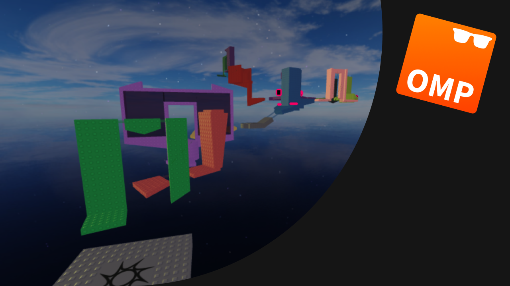

# Oh My Prvd Obby Example

See how [Oh My Prvd](https://github.com/team-fireworks/ohmyprvd) can be used to
build a simple obby, decked with a JToH-esque client objects provider, a
checkpoints provider, a networking provider, and a debug provider.

Play the game: <https://www.roblox.com/games/18703010727/Oh-My-Prvd-Obby>

## Highlights

- ObjectsProvider for loading client objects inspired by[Jukes Towers of
  Hell](https://www.roblox.com/games/8562822414/Jukes-Towers-of-Hell) and the
  [Multi-Tower
  Kit](https://www.roblox.com/games/6441545053/Fanofpixels-Multi-Tower-Kit-V4-Template-Place)
- PlayerProvider for managing checkpoints and session info
- NetProvider for managing RemoteEvents
- GuiProvider for managing confetti and win message made with Fusion 0.3
- DebugProvider for including a Noclip tool while playtesting
